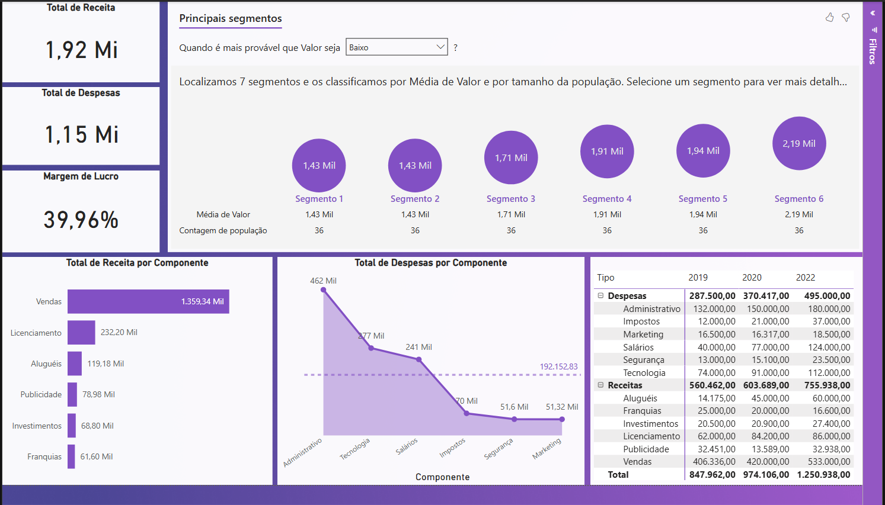

# 📊 Análise Financeira — Receita, Despesas e Margem

> Dashboard de performance financeira (P&L) com segmentação por IA e comparativo multianual.

## 🎯 Objetivo

Consolidar receita, despesas e margem de lucro de uma operação em um único painel executivo,
permitindo identificar rapidamente quais componentes de receita e despesa mais impactam o
resultado financeiro, além de segmentar registros por perfil de valor.

## 🛠️ Ferramentas e Técnicas

- **Power BI Desktop**
- **DAX** (medidas de margem, totais e variação percentual)
- **Visual de IA — Key Influencers / Principais Segmentos** (segmentação automática por valor)
- Modelagem de dados e relacionamento entre tabelas de receita/despesa

## 🔍 Principais Insights

- Receita total de **R$ 1,92 Mi**, despesas de **R$ 1,15 Mi** e margem de lucro de **39,96%**.
- **Vendas** é o principal componente de receita, respondendo por cerca de **71% do total**
  (R$ 1,36 Mi), seguido por Licenciamento, Aluguéis, Publicidade, Investimentos e Franquias.
- **Administrativo** lidera as despesas (R$ 462 mil), à frente de Tecnologia, Salários,
  Impostos, Segurança e Marketing.
- O visual de IA "Principais Segmentos" identificou **7 segmentos** de registros, com valor
  médio variando de **R$ 1,43 Mi a R$ 2,19 Mi**.
- Comparativo multianual mostra crescimento consistente da receita total: de **R$ 560 mil**
  (2019) para **R$ 756 mil** (2022).

## 🖼️ Prints

## 📁 Sobre os Dados

> ⚠️ Os  dados  foram  extraídosdo  portal  da  Nasdaq 
Os  dados  foram  extraídosdo  portal  da  Nasdaq 
https://www.nasdaq.com/

## 👤 Autor

**Caio Regallo** — Analista de Dados Júnior | Business Intelligence
[[LinkedIn](https://www.linkedin.com/in/caio-regallo-a2366516b/)](#) · [[Portfólio](https://github.com/caioregallo/portfolio-powerbi)](#)
