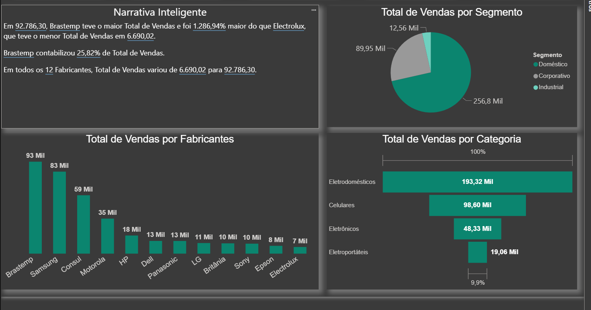
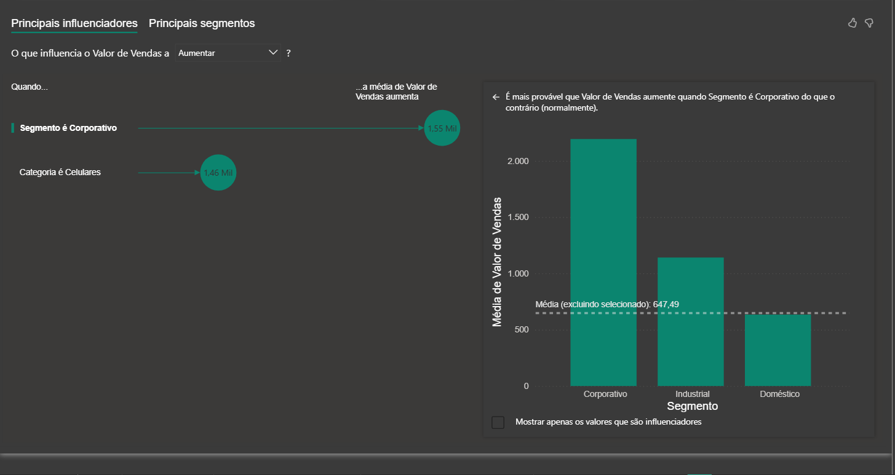
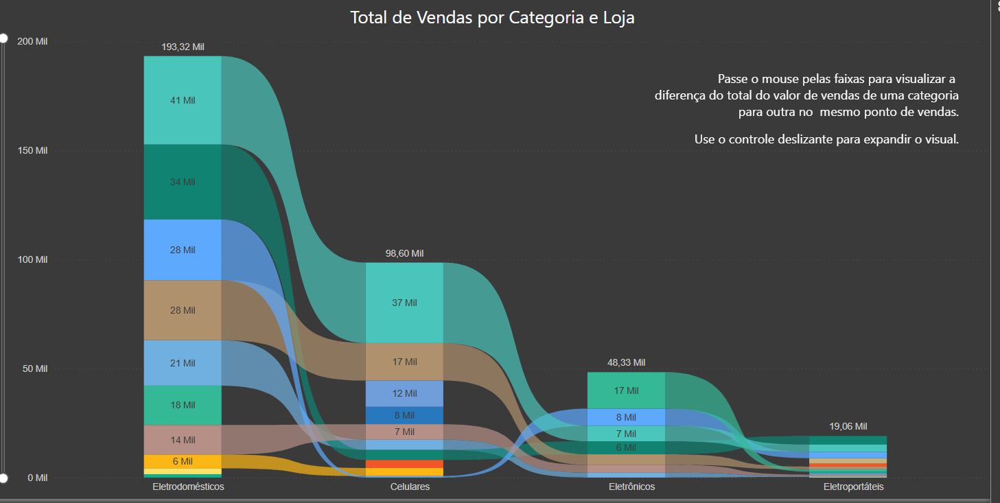
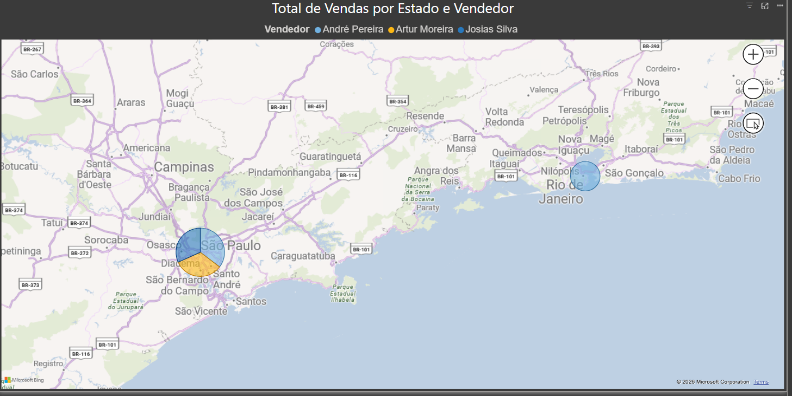

# 📊 Análise de Vendas | Fabricantes e Canais

> Dashboard de vendas por fabricante, segmento e canal, com narrativa e segmentação geradas por IA.

## 🎯 Objetivo

Analisar o desempenho de vendas de uma rede de eletrodomésticos/eletrônicos por fabricante,
segmento de cliente (Doméstico, Corporativo, Industrial), categoria de produto, ponto de venda
e vendedor  apoiando decisões de mix de produto e alocação de força de vendas.

## 🛠️ Ferramentas e Técnicas

- **Power BI Desktop**
- **DAX** (totais, percentuais e variação entre fabricantes)
- **Narrativa Inteligente (Smart Narrative)**  texto gerado automaticamente por IA a partir dos dados
- **Principais Influenciadores / Segmentos (Key Influencers)**  IA para identificar o que eleva o valor de venda
- **Gráfico de Fluxo (Sankey)** decomposição de vendas por categoria e loja
- **Mapa** — distribuição geográfica de vendas por estado e vendedor

## 📐 Estrutura do Dashboard

| Página | Conteúdo |
|---|---|
| 1. Visão Geral | Narrativa inteligente, vendas por segmento, fabricante e categoria |
| 2. Influenciadores (IA) | O que mais eleva o valor médio de venda |
| 3. Fluxo por Categoria e Loja | Decomposição do total de vendas por ponto de venda |
| 4. Mapa por Estado e Vendedor | Distribuição geográfica das vendas por vendedor |

## 🔍 Principais Insights

- Entre **12 fabricantes**, a **Brastemp** lidera com **R$ 92,8 mil** em vendas 
  **25,82% do total** e **1.286,94% acima** do fabricante com menor volume (Electrolux, R$ 6,69 mil).
- Segmento **Doméstico** concentra a maior parte das vendas (R$ 256,8 mil), seguido de
  Corporativo (R$ 89,95 mil) e Industrial (R$ 12,56 mil).
- **Eletrodomésticos** é a categoria líder (R$ 193,32 mil), seguida por Celulares (R$ 98,60 mil),
  Eletrônicos (R$ 48,33 mil) e Eletroportáteis (R$ 19,06 mil).
- A análise de influenciadores (IA) mostrou que vendas no segmento **Corporativo** elevam o
  valor médio de venda para **R$ 1,55 mil** e na categoria **Celulares** para **R$ 1,46 mil**
  — ambos acima da média geral de R$ 647,49.
- O mapa por estado revelou concentração de vendas em **São Paulo** (3 vendedores atuando) e
  **Rio de Janeiro** (1 vendedor).

## 🖼️ Prints

**Visão Geral**

**Principais Influenciadores (IA)**

**Fluxo de Vendas por Categoria e Loja**

**Mapa por Estado e Vendedor**

## 📁 Sobre os Dados

> Os dados foram extraídos do portal da Nasdaq Os dados foram extraídos do portal da Nasdaq https://www.nasdaq.com/

## 👤 Autor

**Caio Regallo** — Analista de Dados Júnior | Business Intelligence
[[LinkedIn](https://www.linkedin.com/in/caio-regallo-a2366516b/)](#) · [[Portfólio](https://github.com/caioregallo/portfolio-powerbi)](#)
