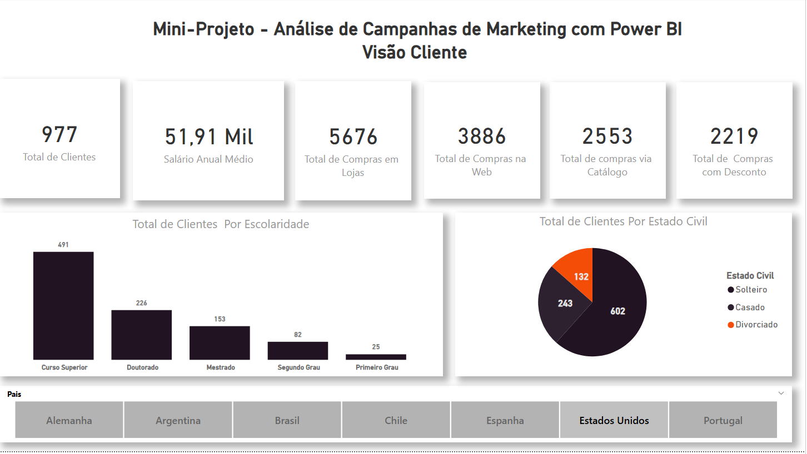
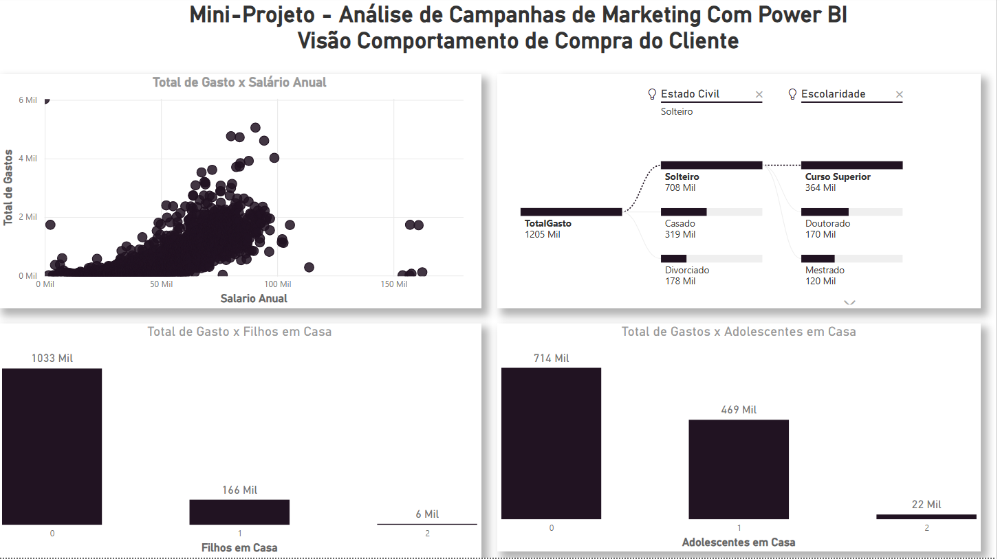
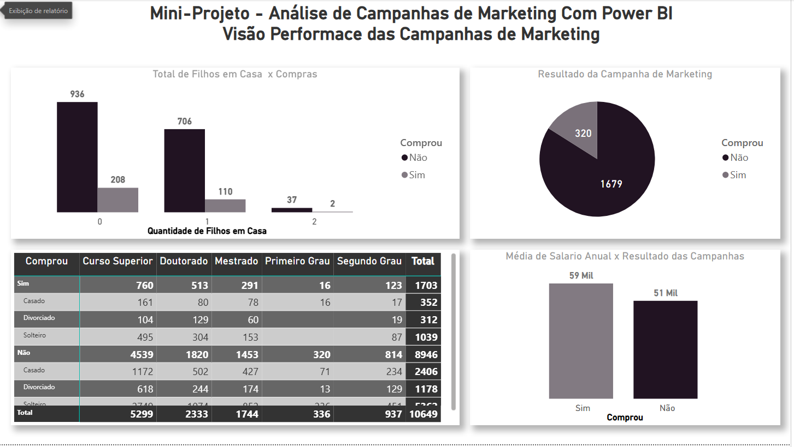
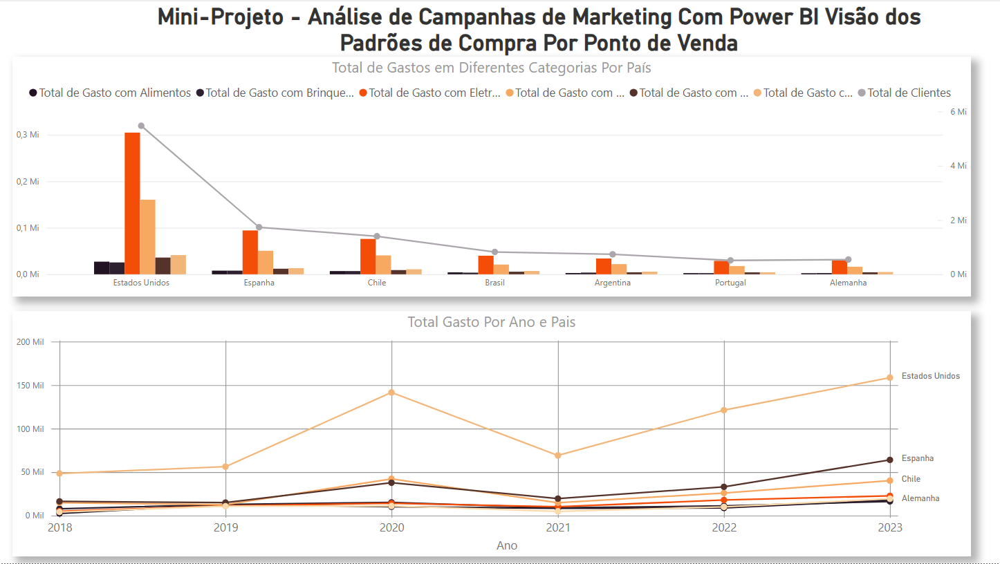

# 📊 Análise de Campanhas de Marketing

> Dashboard de 4 páginas sobre perfil de cliente, comportamento de compra e performance de campanhas.

## 🎯 Objetivo

Entender o perfil sociodemográfico da base de clientes, seu comportamento de compra e a
efetividade das campanhas de marketing, identificando quais perfis têm maior probabilidade
de resposta positiva a uma campanha.

## 🛠️ Ferramentas e Técnicas

- **Power BI Desktop**
- **DAX** (medidas de conversão, médias e totais)
- **Árvore de Decomposição (Decomposition Tree)** quebra de gasto total por estado civil e escolaridade
- **Gráfico de dispersão**  relação entre salário anual e gasto total
- Segmentação por filtros (país, estado civil, escolaridade, filhos/adolescentes em casa)

## 📐 Estrutura do Dashboard

| Página | Conteúdo |
|---|---|
| 1. Visão Cliente | Perfil da base: escolaridade, estado civil, país |
| 2. Comportamento de Compra | Gasto x salário, árvore de decomposição, gasto x filhos/adolescentes em casa |
| 3. Performance das Campanhas | Taxa de resposta às campanhas, cruzada com perfil e salário |
| 4. Padrões por Ponto de Venda | Gasto por categoria e evolução temporal por país |

## 🔍 Principais Insights

- Base de **977 clientes** distribuída em **7 países**, com maior concentração de clientes
  com curso superior (491) e estado civil "Casado" (602).
- A árvore de decomposição mostrou que clientes **solteiros com curso superior** concentram o
  maior gasto entre os segmentos analisados: **R$ 364 mil** dos **R$ 1.205 mil** em gasto total.
- A taxa de resposta às campanhas foi de aproximadamente **16%** (320 de 1.999 clientes).
- Clientes que **responderam positivamente** à campanha têm salário médio **16% maior**
  (R$ 59 mil) do que os que não responderam (R$ 51 mil)  indicando que renda é um fator
  relevante de propensão à conversão.
- Na visão geográfica, os **Estados Unidos** concentram o maior volume de gasto entre os
  7 países analisados, com tendência de crescimento entre 2018 e 2023.

## 🖼️ Prints

**Visão Cliente**

**Comportamento de Compra**

**Performance das Campanhas**

**Padrões por Ponto de Venda**

## 📁 Sobre os Dados

> Os  dados  foram  extraídosdo  portal  da  Nasdaq https://www.nasdaq.com/

## 👤 Autor

**Caio Regallo** — Analista de Dados Júnior | Business Intelligence
[[LinkedIn](https://www.linkedin.com/in/caio-regallo-a2366516b/)](#) · [[Portfólio](https://github.com/caioregallo/portfolio-powerbi/)](#)
