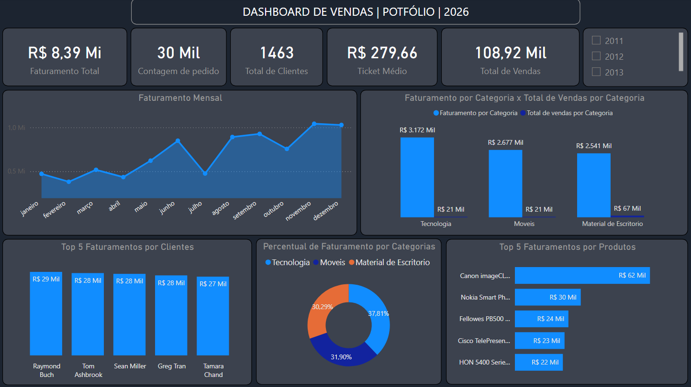

Dashboard de Vendas | Análise de Dados

Projeto de análise de dados desenvolvido com **SQL, Power BI, DAX e PowerPoint**, com o objetivo de transformar dados de vendas em informações úteis para análise e tomada de decisão.

O projeto contempla desde a exploração e análise dos dados em SQL até a construção de um dashboard interativo no Power BI e uma apresentação dos principais resultados.

Objetivo

Analisar o desempenho de vendas e identificar padrões relacionados a faturamento, pedidos, clientes, produtos e categorias.

O projeto busca responder perguntas como:

Qual foi o faturamento total?
Como o faturamento evoluiu ao longo dos meses?
Qual categoria representa a maior parcela do faturamento?
Quais clientes apresentam maior faturamento?
Quais produtos geram maior receita?
Qual é o ticket médio?
Qual é o volume total de vendas?

---

Ferramentas utilizadas

PostgreSQL / SQL — exploração, consultas, agregações e análises dos dados.
Power BI — criação do dashboard e visualização dos indicadores.
DAX — criação das principais métricas utilizadas no dashboard.
PowerPoint — apresentação e comunicação dos resultados.

---

Etapas do projeto

Dados
  ↓
Exploração em SQL
  ↓
Análise dos dados
  ↓
Criação das métricas
  ↓
Power BI
  ↓
Dashboard
  ↓
Análise dos resultados
  ↓
Apresentação

1. Exploração dos dados

Inicialmente foram analisadas as tabelas disponíveis e suas estruturas, identificando os principais campos e relacionamentos entre:

Vendas
Pedidos
Produtos
Clientes

Também foram realizadas verificações de quantidade de registros, clientes e relacionamentos entre as tabelas.

2. Análise com SQL

Foram utilizadas consultas SQL para realizar agregações, agrupamentos e análises de faturamento.

Entre as principais análises estão:

Faturamento total;
Faturamento por categoria;
Percentual de faturamento por categoria;
Faturamento por mês;
Top clientes por faturamento;
Top produtos por faturamento;
Quantidade de pedidos;
Quantidade de clientes;
Volume de vendas.

Os códigos utilizados no projeto estão disponíveis na pasta `SQL`.

---

Dashboard

O dashboard foi desenvolvido no Power BI com foco em uma leitura rápida dos principais indicadores e análises.

Principais indicadores

Faturamento Total: R$ 8,39 milhões
Total de Pedidos: aproximadamente 30 mil
Total de Clientes: 1.463
Ticket Médio: R$ 279,66
Total de Vendas: aproximadamente 108,92 mil unidades

Análises apresentadas

Evolução do faturamento mensal;
Faturamento por categoria;
Total de vendas por categoria;
Top 5 clientes por faturamento;
Participação das categorias no faturamento;
Top 5 produtos por faturamento;
Filtro por ano.

---

Principais insights

A análise mostrou diferenças importantes entre volume de vendas e faturamento.

A categoria Tecnologia apresenta a maior participação no faturamento, enquanto outras categorias possuem participação relevante mesmo apresentando diferentes volumes de unidades vendidas.

Também foi possível identificar os clientes e produtos que mais contribuem para a receita, permitindo observar quais segmentos possuem maior impacto financeiro no negócio.

--------

Dashboard

---

Apresentação

A apresentação em PowerPoint contém a contextualização do projeto, as principais análises realizadas e os resultados obtidos a partir dos dados.

---

Aprendizados

Este projeto foi desenvolvido com foco não apenas na construção do dashboard, mas também no entendimento da lógica por trás das análises.

Durante o desenvolvimento foram trabalhados conceitos como:

SELECT
SUM
GROUP BY
ORDER BY
HAVING
JOIN
Subqueries
DISTINCTCOUNT
Medidas DAX
Relacionamentos entre tabelas
Construção de indicadores
Visualização e comunicação de dados

O projeto também permitiu compreender a diferença entre identificar um registro, agrupar dados e alcular métricas, conectando a análise realizada em SQL com a construção do dashboard no Power BI.

---

Autor

Caio Regallo

Projeto desenvolvido para portfólio na área de Análise de Dados / Business Intelligence.

